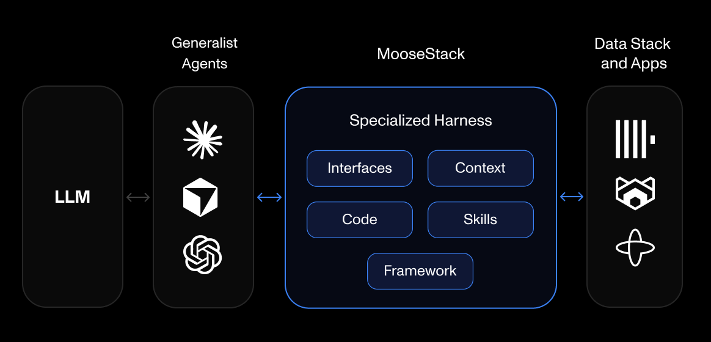

# MooseStack

**The developer agent harness for ClickHouse** — MooseStack gives your AI coding agents the interfaces, context, code, and skills to build and ship applications on popular OSS realtime analytical infrastructure: safely, efficiently, and effectively. Including:
- [ClickHouse](https://clickhouse.com/) (realtime OLAP)
- [Redpanda](https://redpanda.com/) (streaming)
- [Temporal](https://temporal.io/) (workflow orchestration)
- [Redis](https://redis.io/) (internal state)

Generalist coding agents like Claude Code, Cursor, and Copilot work well for most coding tasks. But ClickHouse and realtime analytical infrastructure are specialized terrain. MooseStack sits between your agent and your data stack, and enables your agent to handle the stickiest parts of building out applications on real time analytical infra. Think:
- Optimizing data models & queries for OLAP
- Managing schema changes and migrations
- Building out realtime streaming ETL/ELT data pipelines
- Integrating analytics into your frontend application layer

## How it works
In short, when everything is code, coding agents can thrive.

- **Dev framework & CLI**: AI-friendly framework and CLI enable coding agents to iterate quickly and safely on your analytical workloads
- **Local-first experience**: Full mirror of production environment on your laptop with `moose dev`
- **Schema & migration management**: Typed schemas in your application code, with automated schema migration support
- **Code‑first infrastructure**: Declare tables, streams, workflows, and APIs in TS/Python -> MooseStack wires it all up
- **Git-native development**: Version control, collaboration, and governance built-in
- **Modular design**: Only enable the modules you need. Each module is independent and can be adopted incrementally

### Tooling:
- [Moose **Dev**](https://docs.fiveonefour.com/moosestack/dev): Local dev server with hot-reloading infrastructure
- [Moose **Dev MCP**](https://docs.fiveonefour.com/moosestack/moosedev-mcp): AI agent interface to your local dev stack
- [Moose **Language Server / LSP**](https://docs.fiveonefour.com/moosestack/language-server): In-editor diagnostics and autocomplete for agents and devs
- [ClickHouse TS/Py **Agent Skills**](https://github.com/514-labs/agent-skills): ClickHouse, OLAP, and data engineering best practices as agent-readable rules
- [Moose **Migrate**](https://docs.fiveonefour.com/moosestack/migrate): Code-based schema migrations for ClickHouse
- [Moose **Deploy**](https://docs.fiveonefour.com/moosestack/deploying): Ship your app to production

### Modules:

- [Moose **OLAP**](https://docs.fiveonefour.com/moosestack/olap): Manage ClickHouse tables, materialized views, and migrations in code.
- [Moose **Streaming**](https://docs.fiveonefour.com/moosestack/streaming): Real‑time ingest buffers and streaming transformation functions with Kafka/Redpanda.
- [Moose **Workflows**](https://docs.fiveonefour.com/moosestack/workflows): ETL pipelines and tasks with Temporal.
- [Moose **APIs** and Web apps](https://docs.fiveonefour.com/moosestack/apis): Type‑safe ingestion and query endpoints, code-first semantic layer, and bring your own API framework (Nextjs, Express, FastAPI, Fastify, etc.)

## Get Started

- [5-min Quickstart](https://docs.fiveonefour.com/moosestack/getting-started/quickstart)
- [Quickstart with Existing Clickhouse](https://docs.fiveonefour.com/moosestack/getting-started/from-clickhouse)
- [MooseStack Docs](https://docs.fiveonefour.com/moosestack)

## Deploy to Production
### Fiveonefour hosting

The fastest way to deploy your MooseStack application is with [hosting from Fiveonefour](https://fiveonefour.boreal.cloud/sign-up), the creators of MooseStack. Fiveonefour provides automated preview branches, managed schema migrations, deep integration with GitHub and CI/CD, and an agentic harness for your realtime analytical infrastructure in the cloud.

[Get started with Fiveonefour hosting →](https://fiveonefour.boreal.cloud/sign-up)

### Deploy Yourself

MooseStack is open source and can be self-hosted. If you're only using MooseOLAP, you can use the Moose library in your app for schema management, migrations, and typed queries on your ClickHouse database without deploying the Moose runtime. For detailed self-hosting instructions, see our [deployment documentation](https://docs.fiveonefour.com/moosestack/deploying).

## Community

[Join us on Slack](https://join.slack.com/t/moose-community/shared_invite/zt-2fjh5n3wz-cnOmM9Xe9DYAgQrNu8xKxg)

## Contributing

We welcome contributions! See the [contribution guidelines](https://github.com/514-labs/moosestack/blob/main/CONTRIBUTING.md).

## License

MooseStack is open source software and MIT licensed.
